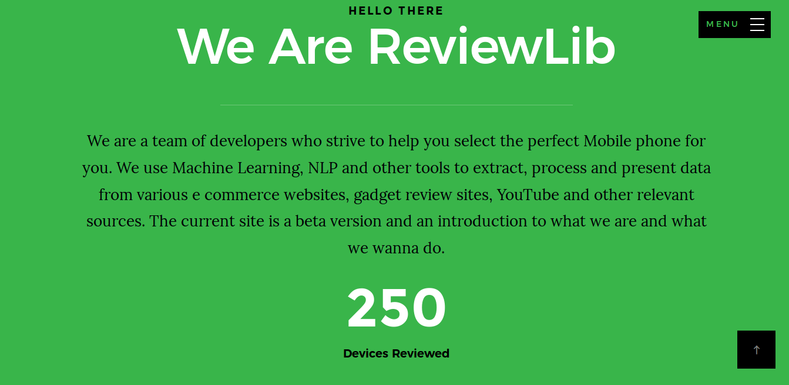
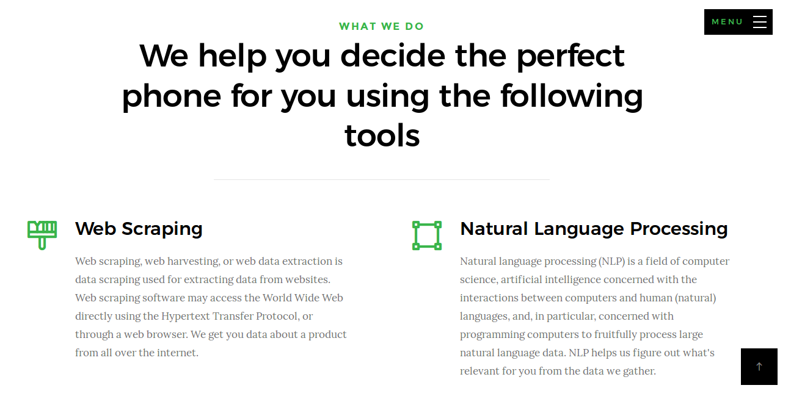
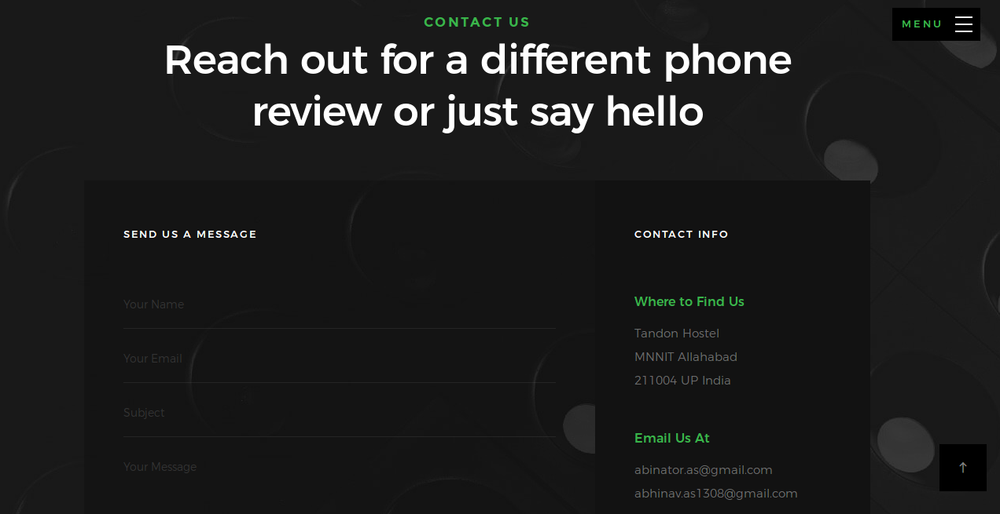

# ReviewLib
Review aggregrator for electronic devices, website made in django. It is live at https://reviewlib.herokuapp.com

# What we do
We are a team of developers who strive to help you select the perfect Mobile phone for you. We use Machine Learning, NLP and other tools to extract, process and present data from various e commerce websites, gadget review sites, YouTube and other relevant sources. The current site is a beta version and an introduction to what we are and what we wanna do.  
250 Devices Reviewed

# Tools Used
<ul>
  <li>Web Scraping</li>
  <li>Natural Language Processing</li>
  <li>Data Visualization</li>
</ul>

# Screen Shots

